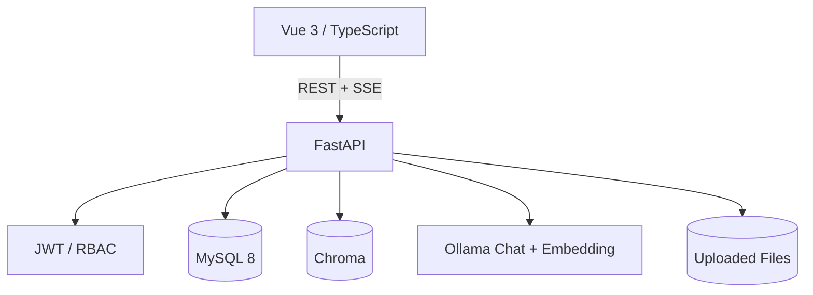

# 总体架构设计

## 1. 系统边界

系统由 Vue 3 前端、FastAPI 后端、MySQL、Chroma 和本地 Ollama 组成。浏览器只访问 FastAPI；模型、向量数据库和业务数据库均处于服务端边界内。

## 2. 后端分层

- API：HTTP 协议、认证、参数校验、状态码与 SSE。
- Service：业务编排、RAG、知识库生命周期、Agent。
- Repository：SQLAlchemy/MySQL 数据访问。
- Model/Schema：数据库模型与 API 类型。
- Integration：Ollama 与 Chroma。

## 3. 数据职责

- MySQL：用户、会话、消息、反馈、配额、知识库/文档/Chunk 元数据、来源快照。
- Chroma：Embedding 向量、检索文本、向量元数据。
- Uploads：原始上传文件。

MySQL `knowledge_chunks.vector_id` 与 Chroma 向量 ID 关联，删除文档时同步清理。

## 4. 安全边界

- JWT 鉴权；管理员接口服务端强制 RBAC。
- 密码使用 Argon2 哈希，不保存明文。
- 真实 `.env` 不进入 Git。
- 前端不持有 LLM/数据库凭据。
- 文档输入经过类型、大小和解析校验。
