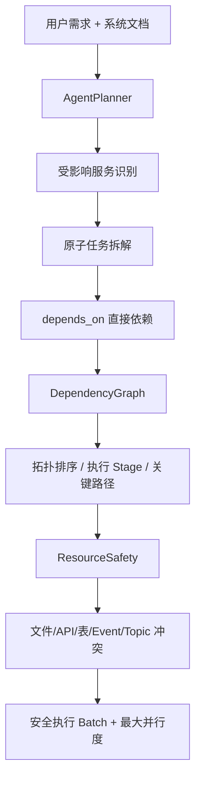

# AI Agent 多微服务任务拆解设计

## 1. 目标

针对“一个需求可能同时改动多个微服务”的研发场景，Agent 接收：

- 用户需求；
- 系统技术文档 / 接口文档上下文；

输出：受影响微服务、原子任务、直接依赖、DAG、可并行阶段、关键路径、资源冲突和安全执行批次。

## 2. 完整流程



## 3. 微服务判断

Planner 只把**确实需要修改代码/配置/契约**的服务放入 `services`。仅调用现有接口但无需修改的服务不应被误判为“受影响服务”。

服务名优先使用输入技术文档中的真实名称；资料不足时写入 `assumptions`，不凭空创造接口。

## 4. 原子任务

每个任务：

- 只属于一个服务；
- 是单一、可验收的改动；
- 有明确 `acceptance_criteria`；
- 跨两个服务的改动拆成两个任务，以依赖关系连接。

示例需求：“用户下单成功后自动发送短信通知”。

```text
T1 order-service：订单成功后发布 OrderCreated 事件
T2 notification-service：消费 OrderCreated 并调用短信通道
T3 notification-service：增加幂等与失败重试
```

依赖可表示为：

```text
T2 depends_on [T1]
T3 depends_on [T2]
```

## 5. DAG 与先后关系

`AgentDependencyGraph` 校验：

- 依赖任务必须真实存在；
- 任务不能依赖自身；
- 图必须无环；
- 计算拓扑排序；
- 计算可同时开始的拓扑 Stage；
- 识别根任务、终点任务和关键路径。

**同一拓扑层只能说明“依赖上可并行”，还不能直接认定“资源上安全并行”。**

## 6. 资源冲突与安全并行

第二层由 `AgentResourceSafety` 分析任务资源画像，例如：

- 文件/模块；
- API；
- 数据库表；
- Event；
- Message Topic。

如果两个无依赖任务会修改同一高风险资源，则不能放在同一安全执行 Batch，即使 DAG 上它们处于同一层。

最终得到：

```text
Dependency parallel candidates
→ Resource conflict filtering
→ Safe execution batches
→ Maximum safe parallelism
```

## 7. 为什么需要两阶段并行判断

只看 `depends_on` 会漏掉隐式冲突。例如：

- T1 修改 `orders` 表；
- T2 也修改 `orders` 表；
- 两者没有显式依赖。

DAG 会认为可并行，但数据库迁移可能冲突。因此依赖拓扑和资源安全必须分开建模。

## 8. API

管理员接口：

```http
POST /api/v1/agent/plans
```

请求包含 `requirement` 与 `system_context`，响应包含 Plan、Dependency Analysis、Parallel Safety、模型、Token 与耗时信息。

## 9. 安全与可解释性

- Planner 温度低，减少结构漂移；
- 输出必须通过 Pydantic Schema 校验；
- JSON 非法时只执行有限修复；
- 不足信息进入 assumptions；
- 跨服务兼容、幂等、补偿等写入 risks；
- DAG 和资源冲突是确定性程序校验，不完全依赖 LLM 自己判断。
