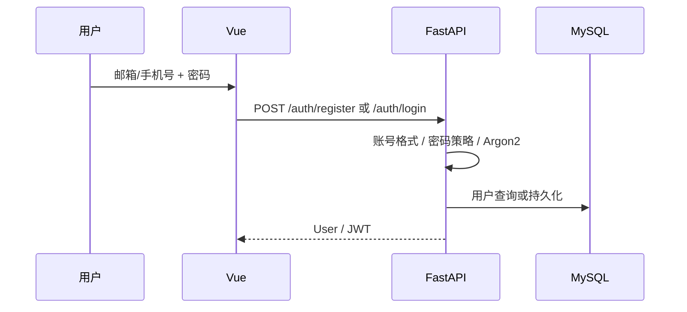
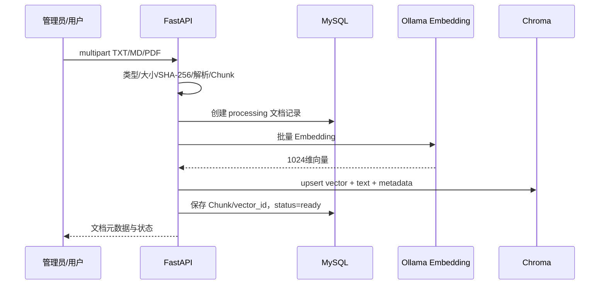
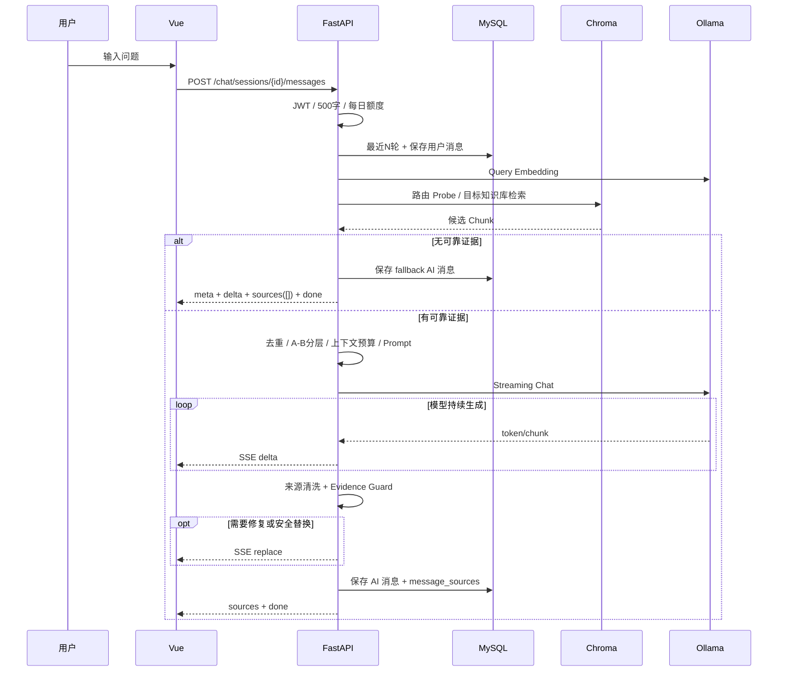

# 业务流程说明

## 1. 用户注册与登录



## 2. 文档上传与向量化



失败时文档记录进入 `failed` 并保存错误信息，避免前端长期停留在“处理中”。

## 3. 智能问答完整链路



## 4. 反馈流程

1. 用户在 AI 消息上选择“有帮助/没帮助”。
2. 可填写最多 1000 字文字反馈。
3. 后端验证该消息属于当前用户可访问会话。
4. 同一用户对同一消息执行 upsert，避免重复反馈。
5. 管理后台聚合满意率及反馈明细。

## 5. 删除文档

```text
确认文档存在
→ 获取全部 Chunk/vector_id
→ 删除 Chroma 向量
→ 更新/删除 MySQL 关联记录
→ 删除上传文件
→ 返回 vector_data_deleted / disk_file_removed
```

删除知识库时对库下所有文档执行级联清理。

## 6. 多知识库路由

未手动绑定知识库的 Session：

```text
Query Embedding
→ 跨库 Probe
→ 相似度聚合
→ routing_description 业务关键词辅助
→ 选择目标知识库
→ 目标库内最终 Top-K
```

若路由或最终检索不足阈值，宁可安全兜底，也不把多个业务库的规则拼在一起猜答案。
