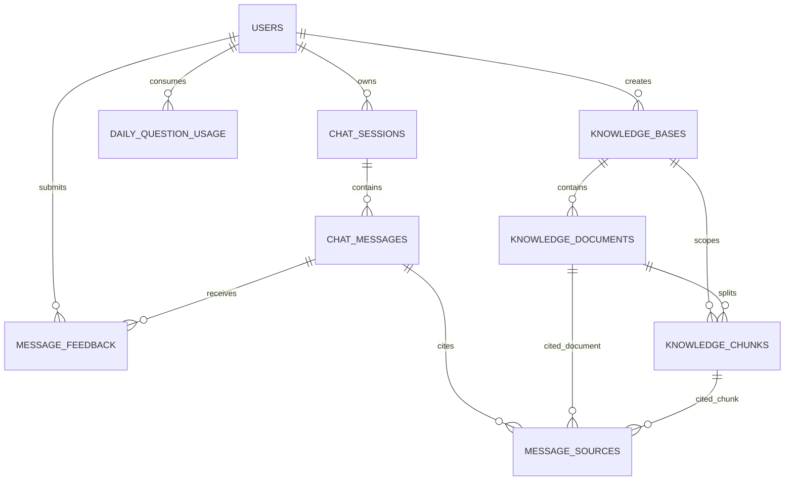

# 数据库设计

## 1. 设计原则

- MySQL 保存**业务事实**；Chroma 保存**向量索引**。
- 知识 Chunk 在 MySQL 中保存 `vector_id`，用于与 Chroma 对应。
- AI 回答引用保存为 `message_sources` 快照，避免后续知识文档变化导致历史回答失去可追溯性。
- 用户每日额度按 `user_id + usage_date` 唯一约束。
- 业务表由 Alembic 管理；`backend/database/schema.sql` 是便于评审的 SQL 快照。

## 2. ER 图



## 3. 表结构

### `users`

用户与管理员账户。

主要字段：`id`、`email`、`phone`、`password_hash`、`display_name`、`role`、`status`、`last_login_at`、时间戳。

约束：邮箱/手机号至少存在一个；Email/Phone 唯一；`role` 为 `user/admin`；密码只保存哈希。

### `chat_sessions`

每次对话是独立 Session。

主要字段：`id`、`user_id`、`title`、`status`、`selected_knowledge_base_id`、`last_message_at`、时间戳。

### `chat_messages`

保存用户、AI、系统消息及 AI 工程元数据。

主要字段：

- `session_id`、`user_id`、`reply_to_message_id`
- `role`、`content`
- `intent`
- `routed_knowledge_base_id`
- `retrieval_status`
- `is_fallback`
- `question_char_count`
- `prompt_token_estimate`、`completion_token_count`
- `follow_up_suggestions`
- `stream_completed_at`

### `message_sources`

AI 回答的来源快照。

主要字段：`message_id`、`document_id`、`chunk_id`、`document_name`、`chunk_summary`、`distance`、`similarity_score`、`rank`。

同一消息的 `rank` 唯一，前端按 rank 展示 `[来源N]`。

### `message_feedback`

点赞/点踩和可选文字反馈。

主要字段：`message_id`、`user_id`、`rating`、`comment`、时间戳。

约束：`rating ∈ {-1,1}`；同一用户对同一消息一条当前反馈。

### `daily_question_usage`

用户每日提问额度。

主要字段：`user_id`、`usage_date`、`question_count`、`updated_at`。

唯一约束：`user_id + usage_date`。

### `knowledge_bases`

多知识库元数据。

主要字段：`name`、`description`、`routing_description`、`is_active`、`created_by`、`deleted_at`、时间戳。

`routing_description` 保存管理员维护的业务关键词/描述，用于辅助自动路由。

### `knowledge_documents`

上传文档及处理状态。

主要字段：

- `knowledge_base_id`
- `original_name` / `stored_name`
- `file_extension` / `mime_type` / `file_size_bytes`
- `sha256`
- `status`：`processing / ready / failed`
- `error_message`
- `chunk_count`
- `content_version`
- `uploaded_by`、`processed_at`、`deleted_at`

### `knowledge_chunks`

MySQL 中的 Chunk 事实记录和 Chroma 映射。

主要字段：`knowledge_base_id`、`document_id`、`chunk_index`、`vector_id`、`content_hash`、`content_text`、`char_count`、`token_estimate`、`priority`、`metadata_json`。

约束：`document_id + chunk_index` 唯一；`vector_id` 唯一。

## 4. MySQL 与 Chroma 关联

```text
knowledge_documents.id
   ↓ 1:N
knowledge_chunks.id / vector_id
   ↓
Chroma record id = vector_id
```

检索时 Chroma 返回 `vector_id` 与元数据，后端再通过 MySQL 校验 Document/Chunk/KnowledgeBase 当前仍有效，避免使用已删除或失效知识。

## 5. 删除策略

### 删除文档

1. 查询文档对应 Chunk/Vector ID。
2. 清理 Chroma 向量。
3. 删除/软删除 MySQL 关联数据。
4. 删除上传文件。
5. 异常时执行恢复/回滚逻辑，防止只删一侧。

### 删除知识库

级联处理该知识库全部文档、Chunk、向量和磁盘文件，并返回清理数量与失败明细。

## 6. 初始化

推荐：

```cmd
python scripts\bootstrap_mysql.py
python -m alembic upgrade head
```

SQL 审阅快照：

- `backend/database/schema.sql`
- `backend/database/seed.sql`
